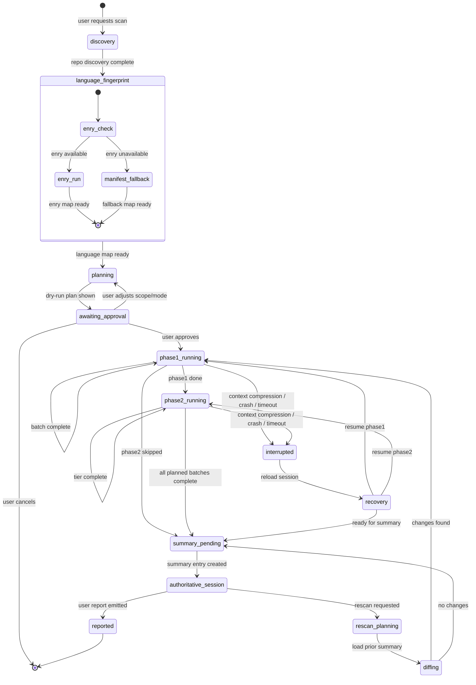
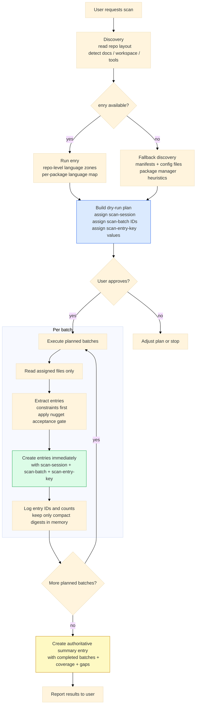
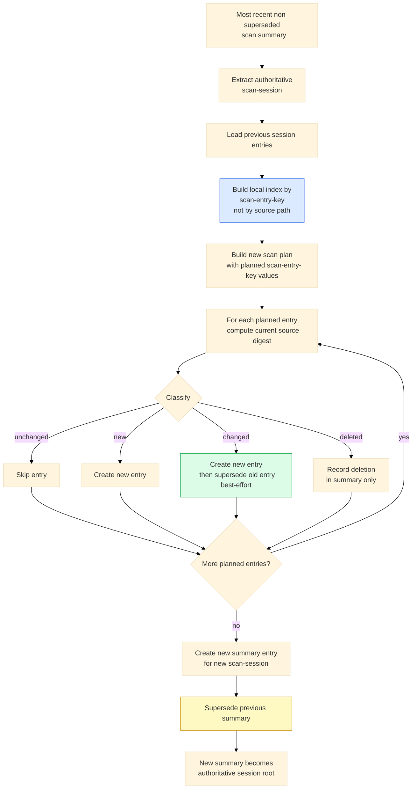

# LeGreffier Scan Flows

Source of truth for:

- scan execution states
- scan batch execution flow
- entry post-processing and re-scan reconciliation

If this document and the scan skill prose diverge, this document wins.

## 1. Scan Execution State Machine

## 2. Batch Execution Flow

## 3. Entry Post-Processing and Re-Scan Flow

## 4. Canonical Rules

- Discovery must perform deterministic language detection with `enry` when available, and fall back to manifest/config heuristics only when `enry` is unavailable.
- The dry-run plan must assign `scan-session`, `scan-batch`, and `scan-entry-key` before execution starts.
- Recovery checks completion by `scan-batch` and planned `scan-entry-key`, not only by category.
- Re-scan reconciliation indexes previous entries by `scan-entry-key`, not by `scan-source`, because one source file may yield multiple entries.
- Phase 2 may extract small representative patterns from targeted source files. It must not perform broad code mining or paste full implementations.
- The summary supersession chain is authoritative. Individual entry supersession is best-effort hygiene.
